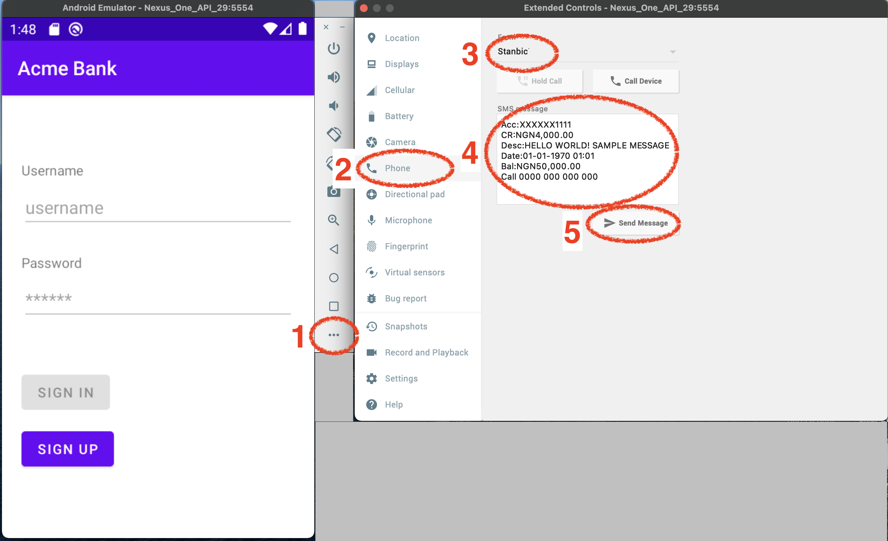

# Pngme Android (React Native) SDK & Sample App

*Welcome to the Pngme v2.x React Native SDK!*<br>
This Readme will cover how the SDK works, get-started basics, and a sample Android app.

### Legacy SDK
[Contact Pngme](mailto:support@pngme.com) for a copy of documentation on the legacy SDK (v1.0.34).

### Kotlin
For the v2.x *Kotlin* docs and sample app, visit [here](https://github.com/pngme/sample-android-app-kotlin).

### Flutter
For the v2.x *Flutter* docs app, ~~visit her~~ *(COMING SOON)*

## React Native v2.x SDK - the basics

1. The SDK accomplishes three tasks:
    - register a mobile phone user with pngme's identity system
    - request permission for SMS from the user, with a [Permission Dialog Flow](.docs/permission_flow.gif)
    - periodically send SMS data to pngme's data processing pipeline
2. The SDK supports Android API level 16+
3. The SDK exposes three methods: a main entrypoint method, and two helper methods
4. Using the SDK requires an SDK `clientKey`. Sign up and get started _for free_ at the [Pngme admin webconsole](https://admin.pngme.com)

When the SDK has been successfully integrated, financial data extracted from a user's SMS will be accessible
in the [Pngme admin Webconsole](https://admin.pngme.com) or
via the Pngme REST APIs
(see the [API Reference docs](https://developers.api.pngme.com/reference/getting-started-with-your-api)).


## Get Started
To set up your project to use the Pngme SDK, follow these setup steps.

### _Step 1_
Add the SDK package to your `package.json` file.
#### Using Yarn

`yarn add @pngme/react-native-sms-pngme-android@2.0.4`

#### Using Npm

`npm install @pngme/react-native-sms-pngme-android@2.0.4 --save`

### _Step 2_
Add your SDK `clientKey` to the project.
In the sample app, the `clientKey` is injected via the `.env` file:

```text
PNGME_CLIENT_KEY=XXXXXXXXXX
```

⚠️ We recommend that additional measures be taken to protect the `clientKey` when implementing in a production app.

### _Step 3_
Implement the `go()` method as needed in your app.

## Methods
### `go()`
```ts
type go = (params: PngmeSDKParamType) => Promise<string>
```

```ts
interface PngmeSDKParamType {
  clientKey: string;
  firstName: string;
  lastName: string;
  email: string;
  phoneNumber: string;
  externalId: string;
  isKycVerified: boolean;
  companyName: string;
}
```
The `go` method is an _async_ function that takes eight required parameters.
The `go` method is the main entrypoint method for invoking the PngmeSdk.
The `go` method is idempotent, and can be invoked multiple times.

The `go` method performs three tasks.
1. register a `user` in Pngme's system using an Android Onetime Worker
2. show a [Permission Dialog Flow](.docs/permission_flow.gif) in the current Activity to request SMS permissions from the user --
   this _runs the first time, and only the first time_, that `go` is invoked
3. check for new SMS messages and send them to Pngme's system every 30 minutes using an Android Periodic Worker

| var name | description |
| -------- | ----------- |
| clientKey | the Pngme SDK key for your account (see above) |
| firstName | the mobile phone user's first name |
| lastName | the mobile phone user's last name |
| email | the mobile phone user's email address |
| phoneNumber | the mobile phone user's phone number, example `"23411234567"` |
| externalId | a unique identifier provided by your app (if none available, pass an empty string `""`)|
|isKycVerified | a boolean, indicating if your app has verified the user's identity using KYC |
| companyName | your company's name; this is used in the display header of the permissions UI flow |

### `resetPermissionFlow()`

```ts
type resetPermissionFlow = () => void
```

As noted above, the [Permission Dialog Flow](.docs/permission_flow.gif) will only run the first time that the `go` method is invoked.
If your app needs to implement logic to show the Dialog Flow again,
then you can reset the permission flow by calling `resetPermissionFlow`.
The next time you call `go`, the Permission Dialog Flow will show again.

Example:
```ts
go(args) // permissions flow runs
go(args)  // permission flow will NOT show again
resetPermissionFlow(args)
go(args)  // permission flow runs
```

See the code snippets in the below documentation of the sample app
for implementations where you might consider using this method to control the Permission Dialog Flow.

### `isPermissionGranted()`

```ts
type isPermissionGranted = () => Promise<boolean>
```

A simple _async_ helper function to indicate if the user has accepted the SMS permissions request.
Returns a Promise with `true` if the user has accepted the SMS permission request.
Returns a Pr0mise with `false` if the user has denied the SMS permission request.

## Sample Android App
This repository is a sample Android app, which uses the Pngme SDK.
This app uses the `.env` file to inject the SDK `clientKey`.
As noted above, it is highly recommended that additional measures be taken to protect the `clientKey` 
when implementing in a production app.

This app can be compiled and emulated locally, with or without a valid SDK `clientKey`.
If a valid SDK `clientKey` is used, then data can be sent thru to the Pngme system while testing in emulation mode.
To run the sample app locally, simply install dependencies and launch the app:
```bash
yarn install
npx react-native run-android
```
⬆️ Running the above assumes you have set up your environment for Android development in React Native.
See the [React Native Official Docs](https://reactnative.dev/docs/environment-setup)

### Behavior
The sample app demonstrates a simple flow:
1. user creates an account with the app
2. the user goes to apply for a loan, and has the option of selecting to use the Pngme service
3. if the Pngme service is selected, the SDK is invoked, and the [Permission Flow](.docs/permission_flow.gif) is presented
4. when the permission flow exits, the user is presented with the loan application page

The SDK is implemented in the `screens/permissions/index.js`, when the user clicks on the *Continue* button:
```ts
const handleContinue = async() => {
    if (toggleCheckBox) {
      // if user confirm they want to use Pngme, we store that selection
      setUser({ pngmePermissionWasSelected: true });
      await go({
        clientKey: RNConfig.PNGME_CLIENT_KEY,
        firstName: user.firstName,
        lastName: user.lastName,
        email: user.email,
        phoneNumber: `234${user.phoneNumber}`,
        isKycVerified: false,
        companyName: 'Acme Bank',
        externalId: '',
      });
      navigateToLoanScreen();
    } else {
      navigateToLoanScreen();
    }
  }
```

The app remembers the selection in step 2.
If the user chooses to enable the Pngme service,
then the checkbox stays selected for all future loan applications.
The [Permission Flow](.docs/permission_flow.gif) is only showed the very first time,
_regardless of if the user accepts or denies the permissions_.

#### Show Permissions Flow Multiple Times
Alternative behavior is to continue requesting SMS permissions if they were previously denied.
Adding the following snippet will reset the Permission Flow
if SMS permissions had been previously denied but not [permanently ignored](.docs/permissions.md).

```ts
const handleContinue = async() => {
    if (toggleCheckBox) {
        // if user confirm they want to use Pngme, we store that selection
        setUser({ pngmePermissionWasSelected: true });

        const permissionGranted = await isPermissionGranted();
        const canPermissionBeAsked = await canPermissionBeAskedAgain();
        if (!permissionGranted && canPermissionBeAsked) {
            resetPermissionFlow();
        }
        
        await go({
            clientKey: RNConfig.PNGME_CLIENT_KEY,
            firstName: user.firstName,
            lastName: user.lastName,
            email: user.email,
            phoneNumber: `234${user.phoneNumber}`,
            isKycVerified: false,
            companyName: 'Acme Bank',
            externalId: '',
        });
        navigateToLoanScreen();
    } else {
        navigateToLoanScreen();
    }
}
```
## Send SMS data locally
As noted above, the primary responsibility of the Pngme SDK is to send SMS data to the Pngme system.
This can be tested in a sample app running in the local emulator,
assuming the emulated app is running with a valid SDK token.

The following text message is of a recognized format for the Stanbic bank sender: `Stanbic`.
```text
Acc:XXXXXX1111
CR:NGN4,000.00
Desc:HELLO WORLD! SAMPLE MESSAGE
Bal:NGN50,000.00
```

You can inject this fake SMS into the emulated phone by following these steps.
It is advisable that you pre-populate the emulated phone with the SMS _before_ running the sample app.



1. Open the `more` window in the emulator settings
2. Navigate to the `phone` section
3. Set the sender to the string `Stanbic`
4. Copy/Paste the above same message into the message box
5. Hit `Send Message`

After following the above steps to send a fake SMS, run the sample app.
The fake SMS will be sent to the Pngme system using the SDK token from your Pngme account.
If the sample app runs successfully, the financial data in the text message will be accessible
via the [Pngme REST APIs](https://developers.api.pngme.com/reference/getting-started-with-your-api) or in the [Pngme webconsole](https://admin.pngme.com).

## Publishing to the Google Store
So you have a working app! Congrats! But... it's not over yet.
You will still need to whitelist your app with the Google Play store.  
This is a special step necessary for any apps that require SMS permissions from the user.

The whitelisting process is not hard, but if you have never whitelisted an app before, you may want assistance.
Pngme can offer support in whitelisting your app, free of charge.
Simply [contact us](mailto:whitelisting@pngme.com)
and also visit our guide: [Going Live](https://developers.api.pngme.com/docs/going-live-with-the-sdk).
We'll help you get your app through the approval process faster than you can say `Hello World!`

If you insist on whitelisting your app without Pngme's assistance,
please let us know and we will provide you with instructions.
These will help you avoid setbacks when submitting your app for review.
