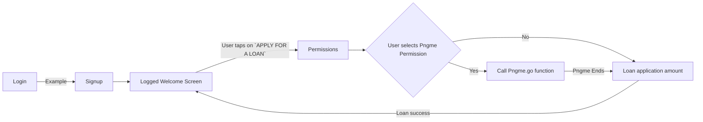

# Pngme Android (React Native) SDK & sample App

*Welcome to the Pngme v2.x React Native SDK!* 
This Readme will cover how the SDK works, get-started basics, and an example Android app.

### Legacy SDK
For documentation on the legacy SDK (v1.0.34) visit [here](https://developers.api.pngme.com/docs).

### Kotlin
For the v2.x *Kotlin* docs and sample app, visit [here](https://github.com/pngme/sample-android-app-kotlin).

### Flutter
For the v2.x *Flutter* docs app, ~~visit her~~ *(COMING SOON)*
# How to run the project

First please check that you have all the needed requirement on [React-Native official docs](https://reactnative.dev/docs/environment-setup)

- Clone the repo
- Create a `.env` file and inside the new file paste `PNGME_CLIENT_KEY=here you should use your demo key`
- Then you should install dependencies `yarn` or `npm install`
- Once dependencies where installed you can run the project with the following command `npx react-native run-android`

# Acme Bank

This sample app simulates to be a basic bank application where a you can sign up, and once you are logged in you can apply for a loan, before loan application you will be able to see a permission screen where you can check if **Pngme SMS SDK** is user or not.

## Flow

## Environment variables handling

We Higly recommend to use any libary to handle .env files, your Pngme key is secret to please do not hardcode it you your code. Remember that push secret keys to a repo is never a good idea.
Also by having env files you can maintain your **sandbox** and **production** keys separately and ready to build with the correct environment

## Where Pngme library is used on this demo app?

If you only want to know how [Pngme npm library](https://www.npmjs.com/package/@pngme/react-native-sms-pngme-android) is used you can check `src/screens/permissions/index.js` there you will see how we use the library for this Acme bank sample project
